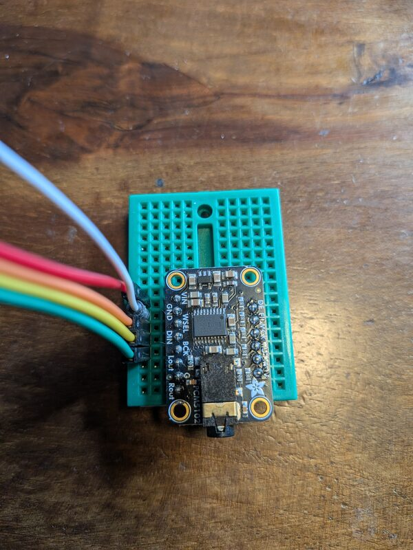
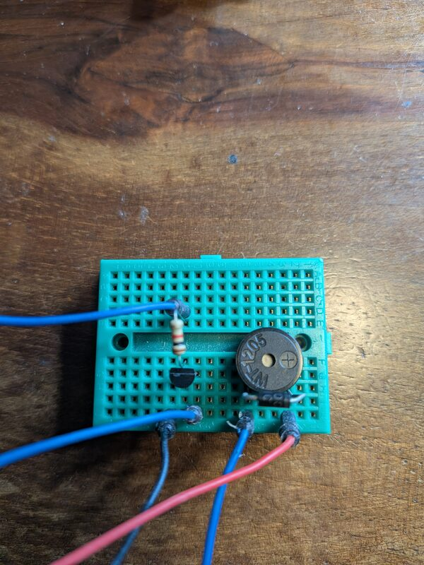
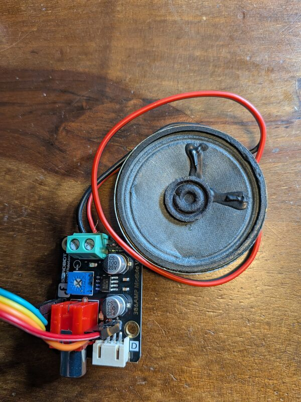

# Connecting audio hardware

How to wire the audio hardware that works with tinyplayer. The pins below are the ones the examples use.

## I2S DAC such as the Adafruit PCM5102

The PCM5102 takes digital audio over I2S and has a line level stereo output. Plug headphones or a powered speaker into the jack. It works on every board tinyplayer supports.



| DAC pin | ESP32 | nRF52 | RP2040, RP2350 |
|---|---|---|---|
| VIN | 3.3V | 3.3V | 3.3V |
| GND | GND | GND | GND |
| WSEL | GPIO4 | P0.04 | GPIO4 |
| DIN | GPIO5 | P0.28 | GPIO2 |
| BCK | GPIO3 | P0.03 | GPIO3 |

On XIAO boards:

| DAC pin | xiao-esp32c3 | xiao-rp2350 |
|---|---|---|
| WSEL | D2 | D9 |
| DIN | D3 | D8 |
| BCK | D1 | D10 |

WSEL is also called WS, LCK or LRCK. BCK is also called BCLK.

Some PCM5102 boards have more pins than the Adafruit one:

- SCK: connect to GND. The DAC then makes its own clock from BCK. See the [PCM5102A datasheet](https://www.ti.com/lit/ds/symlink/pcm5102a.pdf).
- XSMT: connect to 3.3V or the output stays muted.
- FMT, FLT and DEMP: connect to GND.

On RP2040 and RP2350 the WSEL pin must be the pin after BCK.

Run the examples with no extra tags:

```
tinygo flash -target=xiao-rp2350 ./examples/embed
```

### tinypod on the Seeed XIAO expansion board

The expansion board uses D1 for its button, D2 and D8 to D10 for the microSD card, D3 for the buzzer and D4/D5 for the OLED. So tinypod connects the DAC to the Grove A0 and Grove UART pins.

| DAC pin | XIAO pin | xiao-esp32c3 | xiao-rp2350 |
|---|---|---|---|
| WSEL | D7 | GPIO20 | GPIO1 |
| DIN | D0 | GPIO2 | GPIO26 |
| BCK | D6 | GPIO21 | GPIO0 |

## WT-1205 buzzer with a 2N2222 transistor

The WT-1205 is a magnetic buzzer with a coil of about 42 ohm. It needs more current than a pin can give, so drive it from an NPN transistor. The diode catches the voltage spike from the coil when the transistor turns off. This uses the PWM output, so it only works on RP2040 and RP2350.



Parts:

- WT-1205 buzzer
- 2N2222 NPN transistor
- 1N4001 diode
- 1k resistor

```
                5V
                 |
         +-------+-------+
         |               |
      1N4001          WT-1205
     (stripe up)     (+ at top)
         |               |
         +-------+-------+
                 |
                 C
GPIO2 --[1k]-- B   2N2222
                 E
                 |
                GND
```

- Buzzer `+` to 5V, buzzer `-` to the 2N2222 collector.
- 1N4001 across the buzzer, with the stripe (cathode) on the 5V side.
- 2N2222 emitter to GND.
- GPIO2 through the 1k resistor to the 2N2222 base.
- Board GND to the same GND as the 5V supply.

On the xiao-rp2350 GPIO2 is D8. Use the 5V pin for power. GPIO3 is not used.

With the flat side of a TO-92 2N2222 facing you and the legs down, the pins are E, B, C from left to right. Check the datasheet for your part since some are different.

The WT-1205 is loudest near 2.4 kHz, so speech and music sound thin. It works best for beeps and sound effects.

```
tinygo flash -tags speaker -target=xiao-rp2350 ./examples/embed
```

## Speaker with an LM386 board such as the DFRobot 386AMP

The LM386 amplifies the PWM signal and drives a small speaker. The board has a volume knob. This uses the PWM output, so it only works on RP2040 and RP2350.



| 386AMP pin | RP2040, RP2350 | xiao-rp2350 |
|---|---|---|
| Signal | GPIO2 | D8 |
| VCC | 5V | 5V |
| GND | GND | GND |

Use jumper wires and follow the labels on the board. A Gravity cable did not work in testing, so check that its pin order matches.

The LM386 needs at least 4V, so use 5V and not 3.3V. GPIO3 is not used.

The 386AMP mostly worked without a filter. If you hear a whine, add a 1k resistor in series with the signal and a 10nF capacitor from the amp input to GND.

```
tinygo flash -tags speaker -target=xiao-rp2350 ./examples/embed
```
