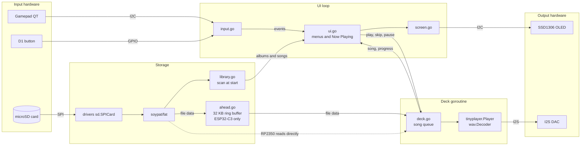

# tinypod

tinypod is an iPod classic style music player. It runs on a XIAO board plugged into the [Seeed XIAO expansion board](https://wiki.seeedstudio.com/Seeeduino-XIAO-Expansion-Board/). It plays WAV files from the microSD card and shows its menus on the OLED.

It runs on the xiao-esp32c3 and the xiao-rp2350.

## Hardware

- xiao-esp32c3 or xiao-rp2350
- Seeed XIAO expansion board, which has the microSD slot, the 128x64 SSD1306 OLED, a button and a buzzer
- An I2S DAC such as the Adafruit PCM5102, with headphones or a powered speaker
- Optional: an [Adafruit Mini I2C Gamepad QT](https://www.adafruit.com/product/5743) and a Grove to STEMMA QT cable
- A FAT32 microSD card of 4 GB to 32 GB (SDHC)

## Wiring

The expansion board connects the SD card, the OLED and the button. You only connect the DAC and the gamepad.

The expansion board already uses D1 for the button, D2 and D8 to D10 for the SD card, D3 for the buzzer, and D4/D5 for I2C. The DAC uses the free pins D0, D6 and D7. Use jumper wires from the expansion board pin headers.

| DAC pin | XIAO pin | xiao-esp32c3 | xiao-rp2350 |
|---|---|---|---|
| VIN | 3V3 | | |
| GND | GND | | |
| BCK | D6 | GPIO21 | GPIO0 |
| WSEL (LCK) | D7 | GPIO20 | GPIO1 |
| DIN | D0 | GPIO2 | GPIO26 |

On the RP2350 the WSEL pin must be the pin after BCK, because of how the PIO I2S program works. See [AUDIO.md](../../AUDIO.md) for the extra pins that some PCM5102 boards have.

Plug the gamepad into the Grove I2C port. It shares the bus with the OLED. The gamepad uses address 0x50 and the OLED uses 0x3C.

## SD card

Put WAV files in folders under `/Music`. Each folder is an album. Files in one level of subfolders are added to the album too. If there is no `/Music` folder, tinypod uses the root of the card.

```
/Music/Album One/01 Song.wav
/Music/Album One/02 Song.wav
/Music/Album Two/Disc 1/01 Song.wav
/Music/Single.wav
```

The song name on the screen is the file name without `.wav`. The album name is the folder name.

Use ffmpeg to make the files. 16 bit stereo at 44.1 kHz or 22.05 kHz both play well.

```
ffmpeg -i in.mp3 -ac 2 -ar 44100 -c:a pcm_s16le out.wav
```

IMA ADPCM files are 4 times smaller and also play.

```
ffmpeg -i in.mp3 -ac 2 -ar 44100 -c:a adpcm_ima_wav out.wav
```

tinypod mounts the card read only. It never writes to the card.

## Build and flash

```
tinygo flash -tags fat_noexfat -target=xiao-rp2350 ./examples/tinypod
tinygo flash -tags fat_noexfat -target=xiao-esp32c3 ./examples/tinypod
```

At start the OLED shows "starting" and then "reading songs". The serial output shows the number of songs and albums, and "gamepad found" if there is a gamepad. If the card does not mount, the OLED shows the error.

## Controls

With the gamepad:

| Control | Menus | Now Playing |
|---|---|---|
| Joystick up/down | Move | Volume |
| Joystick left | Back | Previous song, or start of song after 3 seconds |
| Joystick right | Open | Next song |
| A | Open | Play/pause |
| B or Select | Back | Back to menus |
| Start | Play/pause | Play/pause |
| X/Y | Volume up/down | Volume up/down |
| Expansion board button | Back | Back to menus |

If nothing is playing, Start plays all songs from the start.

With no gamepad, the expansion board button does everything. The action happens when you release the button.

| Press | Action |
|---|---|
| Tap | Move down |
| Hold 0.5 seconds | Open, or play/pause on Now Playing |
| Hold 1.5 seconds | Back |

tinypod looks for the gamepad only at start. To change from one input to the other, reset the board.

## Menus

- Songs shows all songs, sorted by name.
- Albums shows the folders. Open one to see its songs.
- Shuffle Songs plays all songs in random order.
- Now Playing shows the song, the album, the place in the queue, a time bar and the time. When you change the volume, a volume bar shows for 2 seconds.

When you open a song, tinypod plays that list from that song. At the end of the list playback stops.

## How it works

tinypod has two main goroutines. The UI loop reads the input and draws the screen. The deck goroutine plays songs. On the ESP32-C3 a third goroutine reads songs ahead from the card. The arrows show the direction of the data.



### Start

`main.go` silences the buzzer on D3, sets up I2C at 400 kHz and starts the OLED. Then it sets up the I2S output, mounts the SD card and scans the music. Last it looks for the gamepad and starts the UI loop.

### SD card

`card.go` uses the `sd` package from [tinygo.org/x/drivers](https://github.com/tinygo-org/drivers). The card starts at 400 kHz, because the SD specification requires a slow clock during setup. Then the SPI clock goes to 20 MHz. `sd.SPICard` has the block methods that [github.com/soypat/fat](https://github.com/soypat/fat) needs, so the FAT volume mounts on it with no adapter.

### Music library

`library.go` reads the folders once at start. It keeps a list of albums and a sorted list of all songs. Each song is a full path on the card.

### Playback

`deck.go` plays a queue of songs in its own goroutine. It opens each file and gives it to `tinyplayer.Player`, which decodes the WAV data and writes it to the I2S output. When a song ends, the deck plays the next one.

The UI asks for a new song with `play` or `skip`. These set the next position and a cut flag, then call `Player.Stop`. The deck reads the file through its own `Read` method, which returns end of file when the cut flag is set. Thus a song always ends when you ask, even if `Stop` comes before `Play` starts. Pause uses `Player.Pause`, and the time bar uses `Player.Progress`.

### Read ahead

On the ESP32-C3, `ahead.go` reads each song into a 32 KB ring buffer in a separate goroutine. The player decodes from this buffer. The C3 I2S output holds only about 9 ms of audio at 44.1 kHz, and SD reads and screen updates can take longer than that. The buffer holds about 190 ms, so these delays do not stop the audio.

The RP2350 does not use the read ahead buffer. piolib I2S starts one DMA buffer at a time. The SPI transfers in the read ahead goroutine do not yield, so the next audio buffer started late and the audio clicked. On the RP2350 the player reads directly from the card. `readAhead` in `hw_esp32c3.go` and `hw_rp2350.go` selects this.

### Screen

`screen.go` draws into the SSD1306 frame buffer with [tinyfont](https://github.com/tinygo-org/tinyfont). `ui.go` keeps a stack of menus and draws the top one, or the Now Playing screen.

The UI loop runs every 30 ms. It reads the input, and it draws only when something changes. On Now Playing it also draws once per second for the time.

On the ESP32-C3 an I2C write holds the CPU until it is done. A full frame is 1 KB and takes about 30 ms at 400 kHz. Thus `show` sends the frame in 32 byte pieces and yields after each piece, so audio playback can continue.

### Input

`input.go` reads the gamepad through the seesaw chip on it. It reads the buttons as one 32 bit value and the joystick from two ADC channels. A button acts when you push it. The joystick repeats after 400 ms and then every 120 ms while you hold it. The button on D1 measures how long you hold it.

## Files

| File | What it does |
|---|---|
| `main.go` | Setup and start |
| `hw_esp32c3.go`, `hw_rp2350.go` | Buses, I2S output and read ahead setting for each board |
| `card.go` | SD card and FAT mount |
| `library.go` | Album and song scan |
| `deck.go` | Playback goroutine and song queue |
| `ahead.go` | Read ahead ring buffer |
| `screen.go` | OLED drawing |
| `ui.go` | Menus and Now Playing |
| `input.go` | Gamepad and button |

## Known issues

- tinypod needs the `sd` fix in [tinygo-org/drivers#905](https://github.com/tinygo-org/drivers/pull/905). Without it, the SD card does not mount.
- On the RP2350 it needs [tinygo-org/pio#65](https://github.com/tinygo-org/pio/pull/65). Without it, piolib I2S and SPI0 use the same DMA channel, and the board stops when a song starts.
- `go.mod` uses the branches of these two PRs until they are merged.
- The `sd` package reads several blocks at a time correctly only on SDHC cards. Do not use cards of 2 GB or less.
- Cards of 64 GB or more usually come formatted as exFAT. Format them as FAT32.
